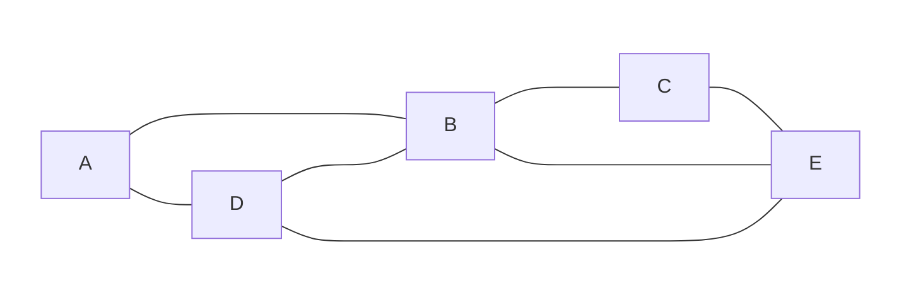

# Final Examination Trimester 2, 2022/2023

## Question 1
1. Construct a truth table to determine whether $(p \to q) \wedge \neg q  \leftrightarrow \neg p$ is a contingency, contradiction, or tautology.
2. Use the logical equivalence laws to show $\neg (p \to \neg q) \vee (\neg r \to q)$ and $q \vee r$ are logically equivalent.
3. Use rules of inference to show that $\forall x (P(x) \to R(x) \wedge Q(x)) \wedge \forall x (\neg P(x) \to T(x)) \wedge \exists x(\neg R(x)) \Rightarrow \exists x(T(x))$.
4. Use mathematical induction to prove that for all integers $n \ge 1$, $2+4+6+...+2n = n^{2} + n$

## Question 2
1. Let A be a set of vowels in the English alphabet and B = {x|x is a letter from the word "MOUNTAIN"}.
    1. List out the unique elements of sets A and B.
    2. Find $A \Delta B$.
    3. Find $P(B-A)$.
2. Suppose S is a relation on Z that S = {(a, b)| $a + b \ge 2$ }. Is S symmetric? Justify your answer.
3. Let $f:Z^+ → Z, f(x) = 2x^2+2$. Is f one-to-one? Justify your answer.
4. Show that $g(x) = 3xlnx + 2x^2$ is $O(x^2)$. 

## Question 3

1. Given the following graph:
    1. Construct a spanning tree using the depth-first search algorithm if B is the root and the selection of neighbouring vertex is according to the undiscovered adjacent vertices with the lowest alphabetical order. Present your answer in a table with three columns, the first column is the number of steps, the second column is the stack for the search algorithm and the third column is the edges of the resulting spanning tree.
    2. Determine whether the graph has an Euler circuit. Find the Euler circuit, if it exists.
  
<table>
  <thead>
    <tr>
      <th rowspan="2">State</th>
      <th colspan="2">Next state</th>
    </tr>
    <tr>
      <th>a</th>
      <th>b</th>
    </tr>
  </thead>
  <tbody>
    <tr>
      <td>s0</td>
      <td>s1</td>
      <td>s0</td>
    </tr>
    <tr>
      <td>s1</td>
      <td>s2</td>
      <td>s0</td>
    </tr>
    <tr>
      <td>s2</td>
      <td>s2</td>
      <td>s2</td>
    </tr>
  </tbody>
</table>

2. Let A be the finite-state automaton having states S = { $s_0, s_1, s_2$ }, input values I = {a, b), initial state is $s_0$ and the accepting state is { $s_0$ }. The next state function is given as follows:
    1. Construct a state-transition diagram for the automaton A.
    2. Use regular expression to describe the language accepted by the automaton A. 

## Question 4
1. In how many ways a string of length 5 can be formed using letters in the word "DOCUMENT" without repetitions if
    1. the string begins with the letter "M".
    2. all vowels must be selected and arranged next to each other.
2. A bowl contains 5 red balls, 4 green balls, 3 blue balls, and 6 yellow balls. Ali selects balls at random without looking at them. How many balls must he select to be sure of having at least three balls of the same colour?
3. A space probe near Jupiter communicates with Earth using bit strings. Suppose that in its transmissions it sends a 1 one-third of the time and a 0 two-thirds of the time. When a O is sent, the probability that it is received correctly is 0.95. When a 1 is sent, the probability that it is received incorrectly (as a O) is 0.12. Let "A" be event where a 0 is transmitted by the space probe and "B" be event where a 0 is received on Earth.
    1. Express the events, their dependencies, and probability values in a tree diagram.
    2. What is the probability that a O is received?
    3. What is the probability that a 0 was transmitted, given that a 0 was received?
4. Suppose 3% of students in MMU who are taking the final exam receive special accommodations because of documented disabilities. Consider a random sample of 25 students who have recently taken the exam.
    1. What is the probability that at least 2 received the special accommodation?
    2. Suppose the exam duration is 2 hours for students without special accommodation, whereas accommodated students are allowed 4 hours. What is the expected average time of the students? 
